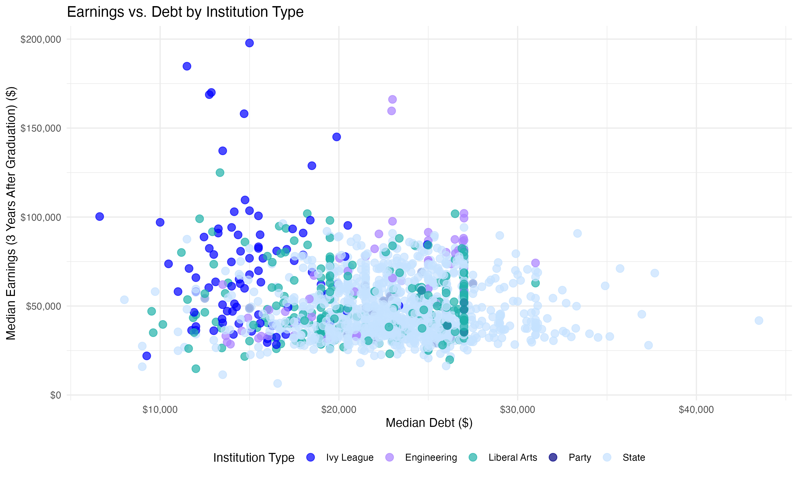
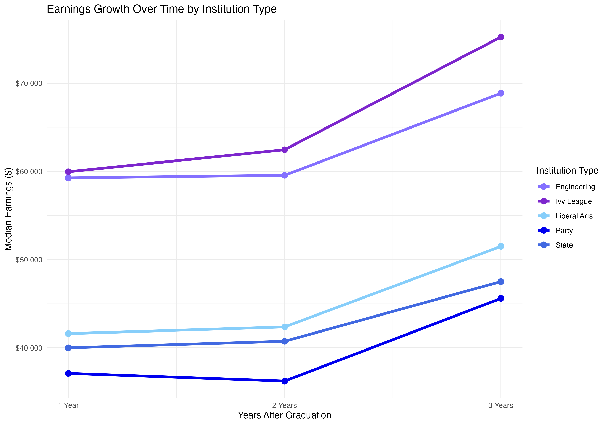
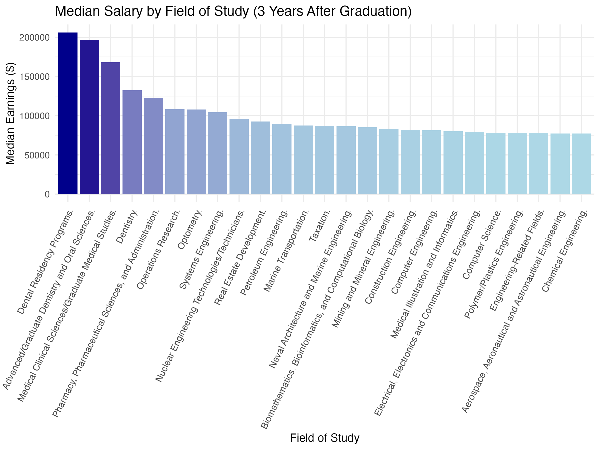
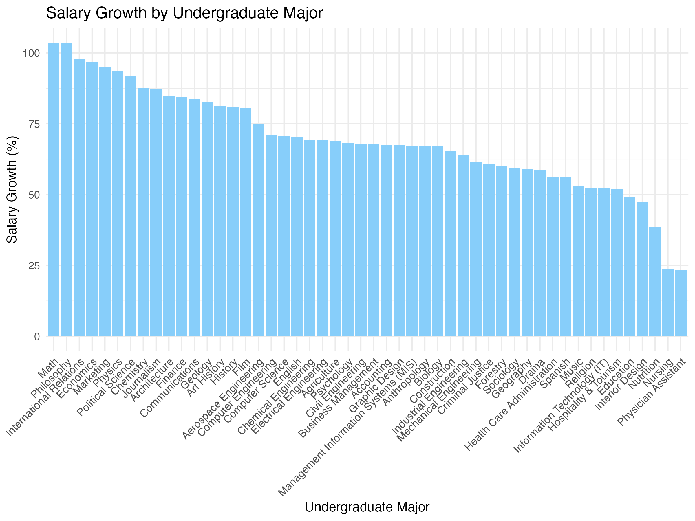
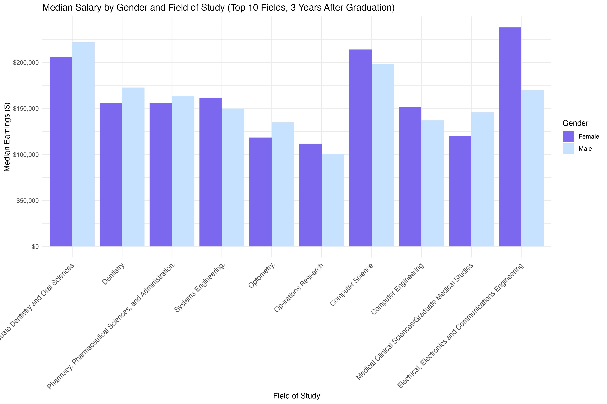
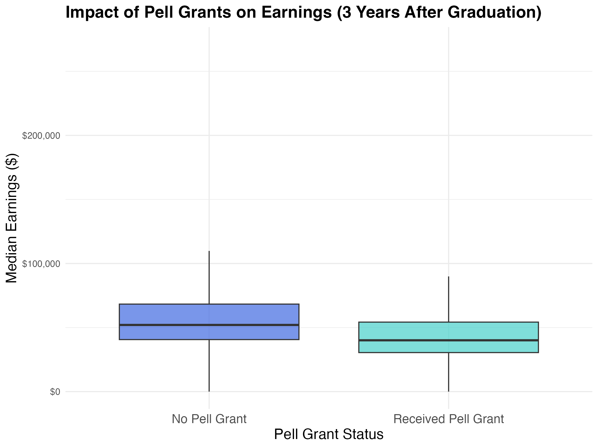
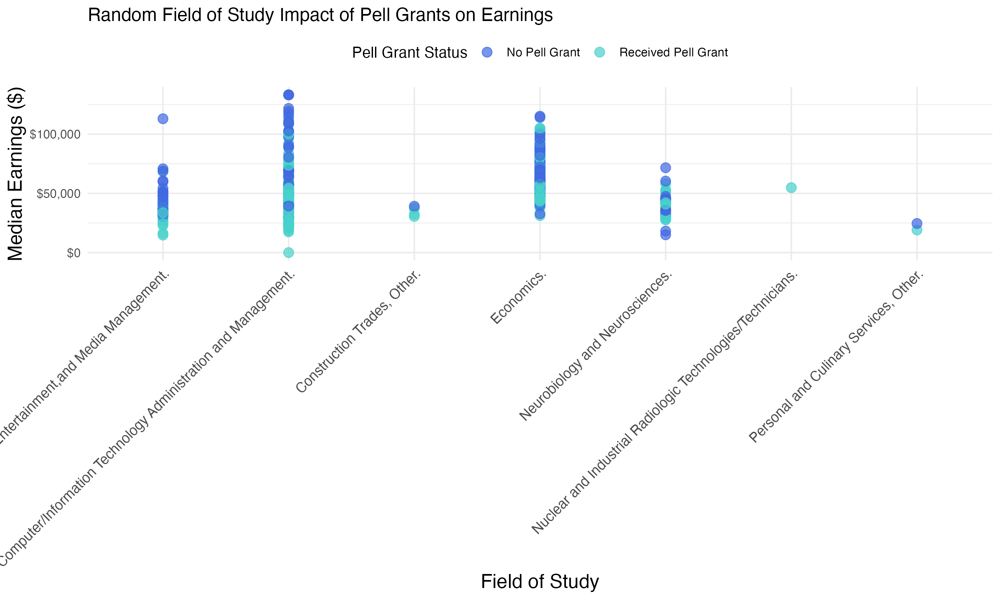
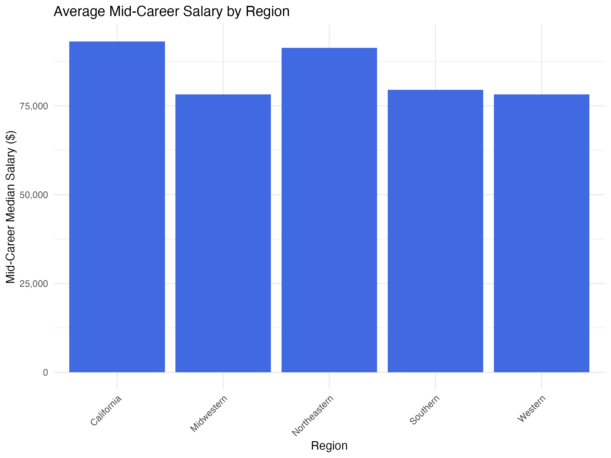
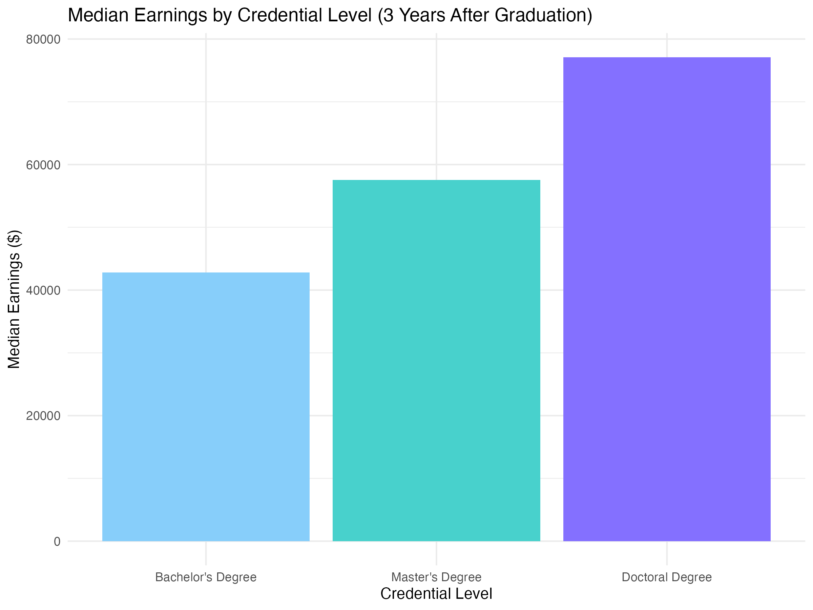

::: {.callout-tip icon="false"}
## Github Repo Link

[Miracle's GitHub Repo Link (miracleramos2025)](https://github.com/stat301-1-2024-fall/final-project-1-miracleramos2025.git)
:::

## Introduction

##### Overview of the Analysis

The primary goal of this analysis is to investigate college salaries and earning potential to better understand how different factors such as degree type, field of study, and institution type affect financial outcomes after graduation. This exploration is motivated by the growing need for transparency in higher education costs and returns, allowing prospective students to make informed decisions about their educational investments.

Key research questions guiding this analysis include:

-   How do earnings evolve in the early years post-graduation?
-   What are the top-performing fields of study and institutions in terms of financial outcomes?
-   How does the earning potential of bachelor’s degrees compare to other credentials?
-   What regional differences exist in starting and mid-career salaries?

To answer these questions, I used two datasets: one from Kaggle and another from College Scorecard. These datasets compliment each other to give a full picture of post-graduation outcomes, covering starting salaries, mid-career growth, and overall return on investment.
<br>

##### Datasets and Sources

1. [Kaggle](https://www.kaggle.com/datasets/wsj/college-salaries): College Salaries Dataset

This dataset, provided by the Wall Street Journal (WSJ), includes salary information for various undergraduate majors and regions. It was downloaded on November 3, 2024 and is publicly available at Kaggle. Key components include:

-   Degrees That Pay You Back: Data on starting and mid-career salaries for undergraduate majors.

-   Salaries by College Type: Salary data segmented by institution type, including starting and mid-career median salaries.

-   Salaries by Region: Regional salary data for both starting and mid-career salaries.

2. [College Scorecard: U.S. Department of Education](https://collegescorecard.ed.gov/data): Most Recent Cohorts Field of Study

This dataset, provided by the U.S. Department of Education, focuses on detailed earnings and debt information by field of study. It was downloaded on November 24, 2024 from the College Scorecard website. Notable features include:

-   Detailed breakdowns of student debt and earnings.
-   Analysis of financial outcomes across various fields of study.
<br>

##### Motivation for Choosing These Datasets

I chose these datasets because they provide unique but related insights into the financial outcomes of higher education. The Kaggle dataset focuses on salary trends for different majors and types of schools, giving a clear picture of mid-career earnings growth. The College Scorecard dataset looks more closely at earnings and debt for specific programs, offering detailed information about financial returns by field of study.

By using both datasets together, this analysis gives a well-rounded view of the value of higher education, exploring key questions about earning potential, salary growth, and the impact of different degrees.
<br>
<br>

## Data Overiew & Quality 

The datasets included in this analysis are well-structured, each presenting different levels of complexity and addressing various aspects of the research questions:
<br>
<br>

##### Degrees That Pay You Back

This dataset consists of 50 rows and 8 columns. It primarily contains categorical variables, with 7 out of 8 columns being categorical (e.g., Undergraduate Major, Percent Change from Starting to Mid-Career Salary). The sole numerical variable is the "Starting Median Salary," which provides critical insight into initial earnings. This dataset is complete, with no missing values (0% missingness).
<br>
<br>

##### Salaries by College Type

This dataset contains 269 rows and 8 columns. All columns are categorical, including variables like "School Name" and "School Type." An important variable for analysis is "Starting Median Salary," which offers a comparison across institution types. Like the first dataset, this one is complete, with no missing values (0% missingness).
<br>
<br>

##### Salaries by Region

This dataset includes 320 rows and 8 columns. Similar to the college type dataset, all columns are categorical, with key variables including "Region" and "Starting Median Salary." There are no missing values (0% missingness), making it a reliable source for regional comparisons.
<br>
<br>

##### Most Recent Cohorts Field of Study

This dataset is significantly larger than the Kaggle datasets, with thousands of rows and over 1,400 columns. To streamline the analysis, I focused on 14 key columns related to earnings, debt, and fields of study. It includes both categorical and numerical variables, such as "EARN_NE_MDN_3YR" (Earnings 3 Years Post-Graduation) and "DEBT_ALL_STGP_ANY_MDN" (Median Debt for All Students). Missing values, marked as "PS" (Privacy Suppressed), were converted to NA and excluded from calculations where necessary. This dataset’s size and complexity required additional cleaning steps, detailed in the appendix.
<br>
<br>

##### Data Summary

Overall, the four datasets are clean and ready for analysis. The Degrees That Pay You Back dataset is straightforward and helpful for comparing salary growth. The Most Recent Cohorts Field of Study dataset is larger and more complex but provides detailed information on earnings, debt, and fields of study. Together, these datasets give a solid base to explore earnings, return on investment, and the value of higher education.
<br>
<br>

## Explorations

### Institution Type and Financial Outcomes

##### Average Starting Median Salary by Institution Type

<div id="tbl-starting-salary"></div>
```{r}

# load packages
library(tidyverse)
library(kableExtra)

# load Kaggle dataset 
degrees_that_pay_back <- read_csv("data/degrees-that-pay-back.csv")
salaries_by_college <- read_csv("data/salaries-by-college-type.csv")
salaries_by_region <- read_csv("data/salaries-by-region.csv")


# convert the "Starting Median Salary" column to numeric
salaries_by_college$`Starting Median Salary` <- as.numeric(
  gsub("[\\$,]", "", salaries_by_college$`Starting Median Salary`)
)

# calculate the average starting salary by school type
salaries_summary_table <- salaries_by_college |>
  group_by(`School Type`) |>
  summarise(Avg_Starting_Salary = mean(`Starting Median Salary`, na.rm = TRUE)) |>
  arrange(desc(Avg_Starting_Salary))

# generate the table
knitr::kable(
  salaries_summary_table,
  format = "html", 
  col.names = c("School Type", "Average Starting Salary ($)")
)


```

[Table 1](#tbl-starting-salary) shows the starting salaries by school type. Ivy League schools have the highest starting salaries, followed by Engineering schools. Liberal Arts, Party, and State schools have lower starting salaries on average.
<br>
<br>

##### Earnings vs. Debt by Institution Type

{#fig-earnings_vs_debts}

This scatterplot in @fig-earnings_vs_debts compares median debt to median earnings three years after graduation, based on institution type. Ivy League and Engineering schools show higher earnings and lower debt, while State, Party, and Liberal Arts schools have more varied results, often with lower earnings. 
<br>
<br>

##### Earnings Growth Over Time by Institution Type

{#fig-earnings_growth} 

This graph in @fig-earnings_growth shows that graduates from Ivy League and engineering institutions experience the highest earnings growth over time, with Ivy League graduates surpassing 75,000 dollars in three years. Graduates from state, party, and liberal arts institutions see slower earnings growth, with median salaries remaining below 60,000 dollars after three years.
<br>
<br>

### Fields of Study and Salaries

##### Median Salary by Field of Study

{#fig-field_of_study} 

This bar chart in @fig-field_of_study shows the differences in median salaries across fields of study three years after graduation, highlighting trends by discipline. This graph shows that fields in health sciences, such as dental and medical residency programs, have the highest median earnings three years after graduation. Engineering and technology-related fields also offer competitive salaries but are slightly lower.
<br>
<br>

##### Average Salary Growth by Undergraduate Major

{#fig-undergrad_major} 

This bar chart in @fig-undergrad_major compares salary growth for different majors. Philosophy, International Relations, and Math majors see the biggest salary increases from starting to mid-career. Nursing and Physician Assistant majors have smaller increases, likely because they start with higher salaries that don’t grow as much.
<br>
<br>

##### Median Salary by Gender and Field of Study
<div id="fig-salary-by-gender"></div>


This bar chart in [Figure 5](#fig-salary-by-gender) shows the median salaries for the top 10 fields of study three years after graduation, comparing males and females. In five fields, males earn higher median salaries, while in the other five, females earn more. This highlights how the pay gap varies across different fields of study.
<br>
<br>

### Financial Aid and Earnings

##### Impact of Pell Grants on Earnings

{#fig-pell} 

This box plot in @fig-pell compares median earnings three years after graduation for students who received Pell Grants versus those who did not. Students who did not receive Pell Grants tend to have slightly higher earnings compared to those who did, highlighting potential disparities in post-graduation income.
<br>
<br>

##### Random Field of Study Impact of Pell Grants on Earnings
<div id="fig-random"></div>


This graph in [Figure 7](#fig-random) shows the impact of Pell Grant status on median earnings across a random selection of fields of study. Generally, students who did not receive Pell Grants tend to have slightly higher earnings compared to those who did, but the difference varies by field. The data highlights potential disparities in post-graduation income influenced by financial aid status.
<br>
<br>

### Regional Comparisons

##### Average Starting Salary by Region

<div id="tbl-region"></div>
```{r}
salaries_by_region$`Starting Median Salary` <- as.numeric(
  gsub("[\\$,]", "", salaries_by_region$`Starting Median Salary`)
)

region_starting_salary_stats <- salaries_by_region |>
  group_by(Region) |>
  summarize(
    Median_Starting_Salary = median(`Starting Median Salary`, na.rm = TRUE),
    .groups = "drop"
  ) |>
  arrange(desc(Median_Starting_Salary))

# table 
kable(
  region_starting_salary_stats,
  col.names = c("Region", "Average Starting Salary by Region ($)"),
  caption = "Summary of Starting Salaries by Region",
  format = "html"
) |>
  kable_styling(bootstrap_options = c("striped", "hover", "condensed", "responsive"))
```
[Table 2](#tbl-region) shows the variation in average starting salaries across different regions. California and the Northeastern region offer higher starting salaries compared to other areas, while the Midwestern and Southern regions have lower averages. These regional differences highlight how location can impact earning potential for recent graduates.
<br>
<br>

##### Average Mid-Career Salary by Region

{#fig-region}

This bar chart in @fig-region shows that people who graduate from schools in the Northeastern region and California tend to have the highest mid-career salaries. The Midwestern and Western regions have lower mid-career averages.
<br>
<br>

### Credential Levels and Earnings

##### Top Institutions by Median Salary With a Bachelor's Degree

<div id="tbl-bachelors"></div>
```{r}
# load data
library(tidyverse)
library(gridExtra)
library(kableExtra)

# load College Scorecard dataset
field_of_study_data <- read_csv("data/Most-Recent-Cohorts-Field-of-Study.csv")

### filtered Data ----
# filter the relevant columns
filtered_field_of_study <- field_of_study_data |>
  select(CIPDESC, CREDLEV, DEBT_ALL_STGP_ANY_MDN, DEBT_ALL_STGP_EVAL_MDN,
         EARN_MDN_HI_1YR, EARN_MDN_HI_2YR, EARN_NE_MDN_3YR,
         EARN_COUNT_WNE_HI_1YR, EARN_GT_THRESHOLD_1YR, EARN_IN_STATE_1YR,
         EARN_MALE_NE_MDN_3YR, EARN_NOMALE_NE_MDN_3YR, 
         EARN_PELL_NE_MDN_3YR, EARN_NOPELL_NE_MDN_3YR)

# replace "PS" with "NA" 
field_of_study_data$EARN_MDN_HI_1YR <- as.numeric(
  ifelse(field_of_study_data$EARN_MDN_HI_1YR == "PS", NA, field_of_study_data$EARN_MDN_HI_1YR)
)
field_of_study_data$EARN_MDN_HI_2YR <- as.numeric(
  ifelse(field_of_study_data$EARN_MDN_HI_2YR == "PS", NA, field_of_study_data$EARN_MDN_HI_2YR)
)
field_of_study_data$EARN_NE_MDN_3YR <- as.numeric(
  ifelse(field_of_study_data$EARN_NE_MDN_3YR == "PS", NA, field_of_study_data$EARN_NE_MDN_3YR)
)

# bachelor's degrees
filtered_field_of_study <- field_of_study_data |>
  filter(CREDLEV == 3, !is.na(EARN_MDN_HI_1YR), !is.na(EARN_MDN_HI_2YR), !is.na(EARN_NE_MDN_3YR))  # Filter for bachelor's degree (CREDLEV == 3)

# median Earnings by Institution
bachelor_institution_salary_summary <- filtered_field_of_study |>
  group_by(INSTNM) |>
  summarize(
    Median_Earnings_1YR = median(EARN_MDN_HI_1YR, na.rm = TRUE),
    Median_Earnings_2YR = median(EARN_MDN_HI_2YR, na.rm = TRUE),
    Median_Earnings_3YR = median(EARN_NE_MDN_3YR, na.rm = TRUE)
  ) |>
  arrange(desc(Median_Earnings_3YR))  

# top 10 institutions
top_bachelor_institutions <- bachelor_institution_salary_summary |>
  slice_head(n = 10)

# table 
knitr::kable(
  top_bachelor_institutions,
  format = "html",
  col.names = c("Institution", "Median Earnings (1st Year)", "Median Earnings (2nd Year)", "Median Earnings (3rd Year)"),
  caption = "Top Institutions by Median Salary With a Bachelor's Degree (1st, 2nd, and 3rd Year After Graduation)"
)
```

[Table 3](#tbl-bachelors) presents the top 10 institutions ranked by median salaries for bachelor’s degree holders. It includes a yearly breakdown of earnings from the first to the third year after graduation. According to the data, Harvey Mudd College is the best institution to pursue a bachelors degree to earn a high salary followed by Princeton University.
<br>
<br>

##### Top Schools for Return of Investment on Bachelor's Degrees

<div id="tbl-roi"></div>
```{r}
library(tidyverse)
library(kableExtra)
#| label: fig-top-bachelors

# load data
field_of_study_data <- read_csv("data/Most-Recent-Cohorts-Field-of-Study.csv")

# check columns are numeric
field_of_study_data <- field_of_study_data |>
  mutate(
    EARN_NE_MDN_3YR = as.numeric(ifelse(EARN_NE_MDN_3YR == "PS", NA, EARN_NE_MDN_3YR)),
    EARN_MDN_HI_1YR = as.numeric(ifelse(EARN_MDN_HI_1YR == "PS", NA, EARN_MDN_HI_1YR)),
    EARN_MDN_HI_2YR = as.numeric(ifelse(EARN_MDN_HI_2YR == "PS", NA, EARN_MDN_HI_2YR)),
    DEBT_ALL_STGP_ANY_MDN = as.numeric(DEBT_ALL_STGP_ANY_MDN) 
  )

# filter for bachelor's degrees 
bachelors_data <- field_of_study_data |>
  filter(CREDLEV == 3, !is.na(EARN_NE_MDN_3YR), !is.na(DEBT_ALL_STGP_ANY_MDN))

# calculate ROI 
bachelors_roi <- bachelors_data |>
  group_by(INSTNM) |>
  summarize(
    Median_Earnings_3YR = median(EARN_NE_MDN_3YR, na.rm = TRUE),  
    Median_Debt = median(DEBT_ALL_STGP_ANY_MDN, na.rm = TRUE),     
    ROI = Median_Earnings_3YR - Median_Debt                   
  ) |>
  arrange(desc(ROI))  # Sort by ROI in descending order

# top 10 schools by ROI
top_bachelors_roi <- bachelors_roi |>
  slice_head(n = 10)

# HTML table 
kable(
  top_bachelors_roi,
  format = "html",
  col.names = c("Institution", "Median Earnings (3rd Year)", "Median Debt", "ROI ($)"),
  caption = "Top Schools for Return of Investment on Bachelor's Degrees"
) |>
  kable_styling(bootstrap_options = c("striped", "hover", "condensed", "responsive"))

```

[Table 4](#tbl-roi) shows that Harvey Mudd College offers the best return on investment (ROI) with high earnings and low debt. Schools like MIT and Carnegie Mellon University also rank high because their graduates have low debt. Even smaller schools, like Bismarck State College and Northwestern Michigan College, provide good value, proving you don’t need to attend a big-name university for a strong financial return. 
<br>
<br>

##### Median Earnings by Credential Level

{#fig-cred} 

This bar chart in @fig-cred compares median earnings across credential levels, highlighting the earning potential of higher degrees such as bachelor's, master's, and doctoral programs. From this bar chart, it's evident that Doctorate degrees have the highest median earnings.
<br>
<br>

##### Earnings Growth by Credential Level

<div id="tbl-cred"></div>
```{r}
#### Earnings Growth by Credential Level ----
library(tidyverse)
library(kableExtra)

# replace "PS" with NA 
filtered_field_of_study <- read_csv("data/Most-Recent-Cohorts-Field-of-Study.csv") |>
  mutate(
    EARN_MDN_HI_1YR = as.numeric(ifelse(EARN_MDN_HI_1YR == "PS", NA, EARN_MDN_HI_1YR)),
    EARN_NE_MDN_3YR = as.numeric(ifelse(EARN_NE_MDN_3YR == "PS", NA, EARN_NE_MDN_3YR))
  )


earnings_growth_credential <- filtered_field_of_study |>
  filter(CREDLEV %in% c(3, 5, 6), !is.na(EARN_MDN_HI_1YR), !is.na(EARN_NE_MDN_3YR)) |>
  group_by(CREDLEV) |>
  summarize(
    Median_Earnings_1YR = median(EARN_MDN_HI_1YR, na.rm = TRUE),
    Median_Earnings_3YR = median(EARN_NE_MDN_3YR, na.rm = TRUE),
    Growth = round(((Median_Earnings_3YR - Median_Earnings_1YR) / Median_Earnings_1YR) * 100, 2)  
  ) |>
  ungroup()  # Ensure data is not grouped after summarization

# labels for credential levels
earnings_growth_credential <- earnings_growth_credential |>
  mutate(CREDLEV = case_when(
    CREDLEV == 3 ~ "Bachelor's Degree",
    CREDLEV == 5 ~ "Master's Degree",
    CREDLEV == 6 ~ "Doctoral Degree",
    TRUE ~ "Other"
  ))

# table
kable(
  earnings_growth_credential,
  col.names = c("Credential Level", "Median Earnings (1st Year)", "Median Earnings (3rd Year)", "Growth (%)"),
  caption = "Earnings Growth by Credential Level (1st to 3rd Year After Graduation)",
  format = "html"
) |>
  kable_styling(bootstrap_options = c("striped", "hover", "condensed", "responsive"))

```

[Table 5](#tbl-roi) shows how earnings grow from the first to the third year after graduation for different credential levels. Bachelor's degree holders see the highest percentage growth in earnings, around 19%, even though they start with the lowest salaries. Master's and Doctoral degrees have smaller percentage increases, likely because their starting salaries are already higher. This highlights the different earning patterns for each level of education.
<br>
<br>

## Conclusion

This analysis highlights the impact of education choices on financial outcomes after graduation. By examining starting salaries, mid-career growth, and earnings by credential levels, it’s evident that factors such as field of study, institution type, and location play an important role in shaping earning potential.

The findings demonstrate that higher degrees generally lead to higher salaries, but bachelor’s degree holders experience the largest percentage growth in early-career earnings. Regional differences and the financial outcomes of specific majors also demonstrate the importance of careful planning when making educational investments. Together, these insights provide a useful framework for understanding the value of higher education and its long-term financial implications.


## Executive Summary

The purpose of this report is to analyze how education choices, including degree type, field of study, institution type, and location, influence earning potential and financial outcomes after graduation. Using datasets from Kaggle and College Scorecard, this report explores key trends in starting salaries, mid-career growth, and long-term financial returns to provide valuable insights for prospective students and stakeholders in higher education.

The analysis revealed that bachelor’s degree holders experience the highest percentage growth in earnings during the first three years after graduation, even though their starting salaries are lower compared to master’s and doctoral degree holders. Doctoral degrees, however, lead to the highest overall earnings three years post-graduation. Fields of study in health sciences, engineering, and technology consistently rank among the highest in median salaries, while philosophy and math majors demonstrate exceptional salary growth over time.

Institution type also plays a significant role in financial outcomes. Graduates from Ivy League and engineering schools enjoy the highest starting and mid-career salaries, along with relatively low debt burdens. Meanwhile, state and liberal arts institutions show more varied results, with earnings and debt levels depending on specific programs. Regional differences highlight the importance of location, with graduates in California and the Northeastern region earning higher starting and mid-career salaries compared to those in the Midwest and South.

Lastly, financial aid status also impacts earnings. Students who did not receive Pell Grants tend to earn slightly more three years after graduation than those who did, highlighting potential income disparities tied to socioeconomic status.

In conclusion, this report emphasizes the importance of making informed decisions about education based on potential financial outcomes. Understanding how degree type, institution, major, and region interact can help students and policymakers navigate the complexities of higher education and its financial implications. These findings provide a strong foundation for future discussions on maximizing the return on investment in education.

##### Comment on AI

ChatGPT assisted in editing my executive summary to make it clear and concise while also helping generate graph ideas for my exploratory data analysis. Furthermore, ChatGPT provided guidance on cleaning the College Scorecard data since it was rather complex and aided in creating functions to highlight key findings.
<br>
<br>
<br>
<br>
<br>
<br>


