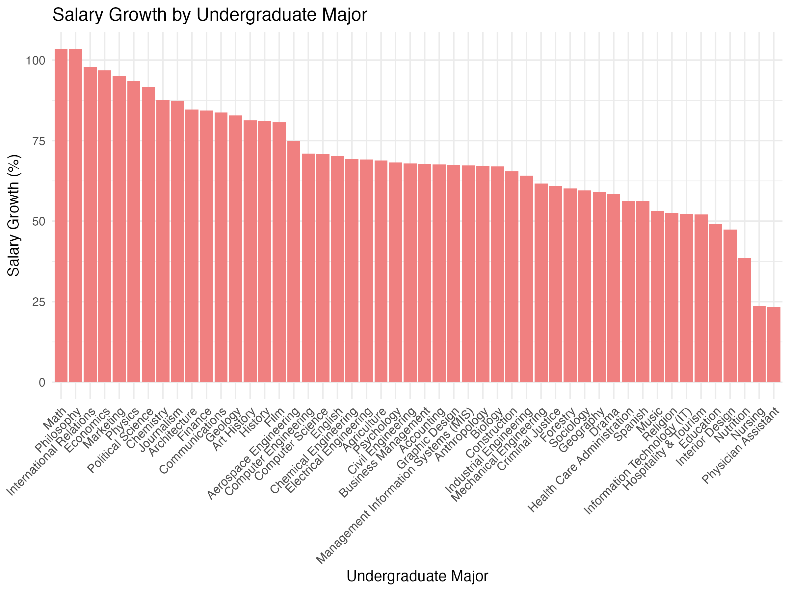
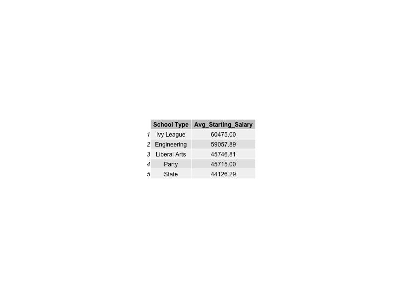

::: {.callout-tip icon=false}

## Github Repo Link

[Miracle's GitHub Repo Link](https://github.com/stat301-1-2024-fall/final-project-1-miracleramos2025.git)

:::

## Data source

Analysis of College Salaries and Earning Potential

The data for this project was sourced from Kaggle, specifically the 'College Salaries' dataset provided by the Wall Street Journal (WSJ). This dataset can be accessed at [Kaggle](https://www.kaggle.com/datasets/wsj/college-salaries) and was downloaded on November 3, 2024.

- Degrees That Pay You Back: This dataset contains starting and mid-career salaries for various undergraduate majors.

- Salaries by College Type: This dataset provides salary data by school type, including starting median salary, mid-career median salary, and percentile salaries.

- Salaries by Region: This dataset includes salary information categorized by region and school, including starting and mid-career salaries.

## Why this data

I chose this data because it offers valuable insights into how college types, regions, and specific majors impact starting and mid-career salaries. I'm interested in this topic because it has real world importance for career choices and education planning. My main questions for this analysis are:

- How do starting and mid-career salaries differ across various types of colleges?
- Which regions show the highest salary growth over time?
- Which majors lead to the greatest salary growth 10 years after graduation?

These questions come from my own desire to better understand how educational choices influence long-term earning potential and career growth.

## Data quality & complexity check

The datasets included in this analysis are well-structured, each presenting different levels of complexity:

The Degrees That Pay You Back dataset consists of 50 rows and 8 columns. It primarily contains categorical variables, with 7 out of 8 columns being categorical (example: Undergraduate Major, Percent change from Starting to Mid-Career Salary). Only one column is numerical, specifically the Starting Median Salary. This dataset is complete, with no missing values and a missingness percentage of 0%.

The Salaries by College Type dataset contains 269 rows and 8 columns. All columns in this dataset are categorical, such as School Name and School Type, indicating that any numerical analysis may require converting these columns or focusing on categorical comparisons. Like the first dataset, this one is also complete, with no missing values and a 0% missingness percentage.

The Salaries by Region dataset includes 320 rows and 8 columns. Similar to the college type dataset, all columns are categorical, with examples including School Name and Region. This dataset has no missing values and a missingness percentage of 0%.

Overall, the three datasets are clean and ready for analysis, with no missing data to impact further processing. The Degrees That Pay You Back dataset has a mix of categorical and numerical data, which will be useful for comparing salary growth.

Plots and Table of the datasets:

This bar chart shows that people who graduate from schools in the Northeastern region tend to have the highest mid-career salaries. California also has good mid-career salaries. The Midwestern and Western regions have lower mid-career averages.

This bar chart compares salary growth for different majors. Philosophy, International Relations, and Math majors see the biggest salary increases from starting to mid-career. Nursing and Physician Assistant majors have smaller increases, likely because they start with higher salaries that don’t grow as much.

This table shows starting salaries by school type. Ivy League schools have the highest starting salaries, followed by Engineering schools. Liberal Arts, Party, and State schools have lower starting salaries on average.

## Potential data issues

- Representativeness: The datasets should represent a wide range of colleges, majors, and regions. If certain school types or majors are underrepresented, this could lead to biased results that may not apply broadly.
- Inflation and Time Relevance: If the salary data spans different years, it might not be adjusted for inflation, making comparisons over time less accurate.
- Sample Size Variability: Some categories (such as certain school types or majors) might have a smaller number of observations, leading to less reliable results or potential bias in those areas.

## Misc
Future questions to look into:

- How does the salary growth from starting to mid-career differ between Ivy League, Engineering, Liberal Arts, and State schools?
- How does the choice of major impact salary growth differently in regions such as the Midwest compared to the Northeast or California?
- How do salary trends change over time for graduates of specific majors as the job market evolves like the rise of tech jobs?
- Which majors or schools offer the best return of investment?

